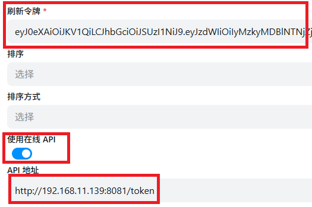

# alitv_openlist

通过阿里云盘TV获取token,只需要超级会员即可不限速、不限流量使用（无需购买第三方流量包）

# 本地运行
需要有node22环境
- 克隆代码
- npm i
- npm run start
- 访问http://localhost:8081/

# docker部署
```
docker run --name=alitv_openlist -d -p 8081:8081 --restart=always ghcr.io/lilu0826/alitv_openlist:latest
```

# 使用教程
访问 http://IP:PORT/


用阿里云盘扫码登录，输入框会出现refresh_ token,复制refresh_token




将refresh_token填写到OpenList的刷新令牌

再把使用在线API勾上

API地址填写：http://IP:PORT/token

确保OpenList部署的机器能访问到http://IP:PORT/token

完事